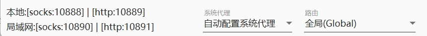
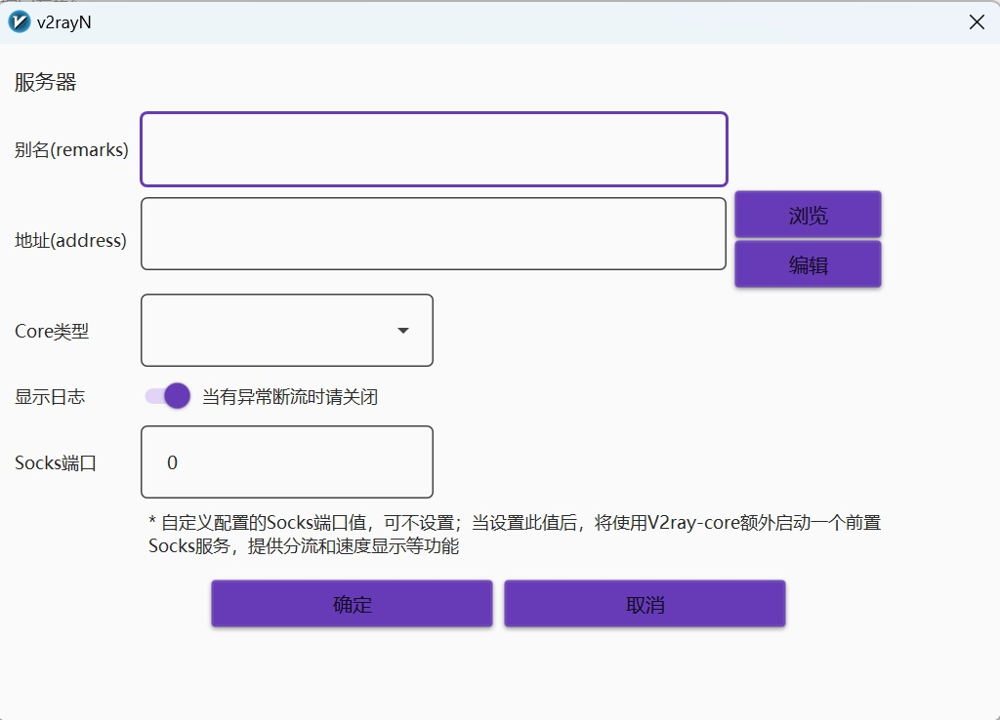
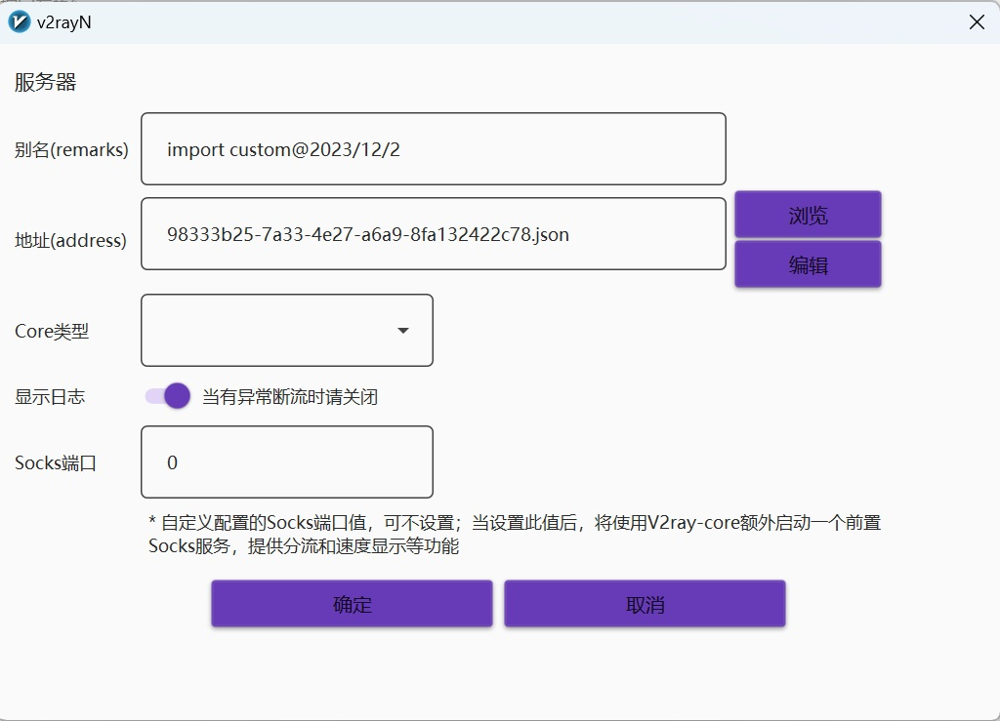
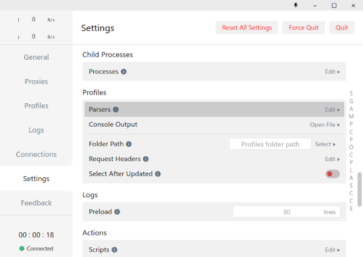

# 概论
新内网基于Shadowsocks协议搭建，使用`aes-256-gcm`加密方式，支持socks5远程DNS解析。

## 获取连接信息
用户可以访问[http://ana.xjtu.edu.cn/ivpn/](http://ana.xjtu.edu.cn/ivpn/)（仅支持校内访问）或[http://xjtuana.com/ivpn/](http://xjtuana.com/ivpn/)（支持校外访问），通过ANA统一身份认证登录之后获得连接密码。连接密码永久有效。如果连接密码泄漏，用户可以访问[http://ana.xjtu.edu.cn/ivpn/reset](http://ana.xjtu.edu.cn/ivpn/reset)（仅支持校内访问）或[http://xjtuana.com/ivpn/reset](http://xjtuana.com/ivpn/reset)（支持校外访问）重置连接密码。

ANA目前同时提供校内访问和校外访问的ivpn Endpoint，其信息如下表所示：

|IP|端口|备注|
|----|----|----|
|58.206.101.49|10580|校内访问|
|16.162.207.175|10580|校外访问|


## 权限管理
ivpn实行RBAC权限管理。根据用户的role不同，用户将被允许访问不同的内网资源。无论用户的role是什么，通过ANA的shadowsocks，用户将不被允许访问ANA内网之外的资源（`10.58.0.0/16`之外的其他地址）。如果用户访问了他不被允许访问的资源，这个链接将会被关闭。出于审计需要，ivpn-server会记录用户的ID，用户访问的内网资源IP和用户的源IP。数据流的内容不会被记录。通过访问[ivpn控制台](http://ana.xjtu.edu.cn/ivpn/)(前端咕咕咕中)，用户可以查询自己的角色和自己被授权访问的资源。如果自己的role有问题请联系部长。

不同服务所需要的权限参考[社团内网服务列表](http://git.ana/xjtuana/docs/src/branch/master/%E8%AF%B4%E6%98%8E%E6%96%87%E6%A1%A3/network.md#xjtuana%E5%86%85%E7%BD%91%E7%9A%84%E5%B8%B8%E7%94%A8%E6%9C%8D%E5%8A%A1)


# 连接方式

本指南仅供参考，大家可以选用任意自己熟悉的*带有策略路由功能的*shadowsocks客户端（如Xray）接入。不管使用什么连接方式，都需要获得密码和endpoint，参考获取连接信息页面。

## 给v2rayN用户的使用指南

桌面端用户可以使用[v2rayN](https://github.com/2dust/v2rayN)软件（带GUI）接入内网。同时可以实现翻墙、内网和直连的三方分流.

1. 撰写以下配置文件

```json
{
  "log": {
    "loglevel": "info"
  },
  "inbounds": [
    {
      "listen": "127.0.0.1",
      "port": 10888,
      "protocol": "socks",
      "tag": "input_socks"
    },
  {
      "listen": "127.0.0.1",
      "port": 10889,
      "protocol": "http",
      "tag": "input_http"
    }
  ],
  "outbounds": [
  {
      "protocol": "freedom",
      "tag": "direct"
    },
    {
    "protocol": "blackhole",
    "settings": {},
    "tag": "block"
  },
    {
        "tag": "proxy"
    #填入你的proxy配置信息
    },
    {
      "sendThrough": "0.0.0.0",
      "protocol": "shadowsocks",
      "settings": {
        "servers": [
          {
            "address": "<EndPoint>",
            "port": 10580,
            "method": "aes-256-gcm",
            "password": "<Password>"
          }
        ]
      },
      "tag": "ana_ivpn"
    }
  ],
  "routing": {
    "domainStrategy": "IPIfNonMatch",
    "domainMatcher": "hybrid",
    "rules": [
      {
        "type": "field",
        "domain": ["domain:ana"],
        "outboundTag": "ana_ivpn"
      },
      {
        "type": "field",
        "ip": ["10.58.0.0/16"],
        "outboundTag": "ana_ivpn"
      },
          {
        "type": "field",
        "domain": ["geosite:category-ads"],
        "outboundTag": "block"
      },
      {
        "type": "field",
        "ip": ["geoip:private"],
        "outboundTag": "direct"
      },
      {
        "type": "field",
        "ip": ["geoip:cn"],
        "outboundTag": "direct"
      },
      {
        "type": "field",
        "ip": ["geoip:!cn"],
        "outboundTag": "proxy"
      },
    {
        "type": "field",
        "domain": ["domain:bing.com"],
        "outboundTag": "proxy"
      }

    ]
  }

}
```

其中上述代码中如下片段中

```json
"inbounds": [
    {
      "listen": "127.0.0.1",
      "port": 10888,
      "protocol": "socks",
      "tag": "input_socks"
    },
  {
      "listen": "127.0.0.1",
      "port": 10889,
      "protocol": "http",
      "tag": "input_http"
    }
  ],
```

的socks和http端口与你的V2rayN监听端口一致，你可以在V2rayN左下角看到监听端口



其中上述代码中如下片段中

```json
{
        "tag": "proxy"
    #填入你的proxy配置信息
    },
```

需要填入你的出国服务器信息，具体参考官方文档或者使用GPT生成

2.



在V2rayN中添加自定义配置服务器，通过“浏览”导入step2中json，无需调整其他任何配置，如下




3. 选择上述添加的服务器，设置代理类型，并选择路由规则为“全局” 

## 给Xray用户的使用指南

*Clash For Windows用户请勿参考本段*

**不建议使用任何Xray的GUI客户端。如果必须要使用你需要自己撰写配置文件。**


因为其完善的策略路由功能和良好的协议支持，ANA推荐使用[Xray](https://github.com/XTLS/Xray-core.git)作为接入内网的客户端。

以下配置文件供参考：

```
{
  "log": {
    "loglevel": "info"
  },
  "inbounds": [
    {
      "listen": "127.0.0.1",
      "port": 8080,
      "protocol": "http",
    },
    {
      "listen": "127.0.0.1",
      "port": 1080,
      "protocol": "socks",
    }
  ],
  "outbounds": [
    {
      "sendThrough": "0.0.0.0",
      "protocol": "freedom",
      "tag": "direct"
    },
    {
      "sendThrough": "0.0.0.0",
      "protocol": "shadowsocks",
      "settings": {
        "servers": [
          {
            "address": "<EndPoint>",
            "port": 10580,
            "method": "aes-256-gcm",
            "password": "<Password>"
          }
        ]
      },
      "tag": "ana_ivpn"
    }
  ],
  "routing": {
    "domainStrategy": "AsIs",
    "domainMatcher": "hybrid",
    "rules": [
      {
        "type": "field",
        "domain": ["domain:ana","domain:dev.xjtuana.cn"],
        "outboundTag": "ana_ivpn"
      },
      {
        "type": "field",
        "ip": ["10.58.0.0/16"],
        "outboundTag": "ana_ivpn"
      }
    ]
  }
}

```

使用此配置文件后XRay将在本地1080端口开启一个socks5服务，设置浏览器等软件的代理到该端口即可访问ANA服务。

因为`*.ana`并不是一个公网上存在的域名，因此需要通过socks5进行DNS解析。配置代理时需要勾选"Proxy DNS when using SOCKS v5"。

如果需要在bash命令行中使用，可以设置：

```
export ALL_PROXY="socks5h://127.0.0.1:1080"
export HTTP_PROXY="socks5h://127.0.0.1:1080"
export HTTPS_PROXY="socks5h://127.0.0.1:1080"
```

如果需要在cmd命令行中使用，可以设置：
```
set all_proxy=socks5h://127.0.0.1:1080
set http_proxy=socks5h://127.0.0.1:1080
set https_proxy=socks5h://127.0.0.1:1080
```

如果需要在powershell命令行中使用，可以设置：
```
$Env:all_proxy = "socks5h://127.0.0.1:1080"
$Env:http_proxy = "socks5h://127.0.0.1:1080"
$Env:https_proxy = "socks5h://127.0.0.1:1080"
```

如果需要在git仓库中使用，可以设置：
```
git config http.proxy socks5h://127.0.0.1:1080
```

如果要使用SSH协议连接内网中的计算机，可以在`~/.ssh/config`中配置：

```
Host *.ana
    ProxyCommand ncat --proxy 127.0.0.1:8083 %h %p
```


## 给Clash For Windows用户的使用指南

*这种接入方式要求Clash中至少有一个可用的订阅链接，如果没有请参考“给非Clash用户的使用指南”*

Clash For Windows 用户需要将ANA内网的连接配置文件和路由规则导入Clash For Windows软件才能够正常使用内网。

### 正在使用由"机场"提供的订阅链接

如果正在使用由"机场"提供的订阅链接，可以将路由模式切换为"Rule"，然后使用如下方式配置：

1. 设置parsers。
进入Clash For Windows的Setting，找到Parsers选项，点击进入编辑，如下图所示。

    

2. 将ANA的节点信息和ANA的路由配置作为parsers导入Clash For Windows。
点击Parsers，进入编辑页面，复制下面代码并填入。将带有尖括号的内容修改为自己的信息，并删除尖括号。

```
parsers:
  - reg: .*
    yaml:
      prepend-rules:
        - DOMAIN-SUFFIX,ana,XJTUANA
        - IP-CIDR,10.58.0.0/16,XJTUANA
      append-proxies:
        - name: XJTUANA
          type: ss
          server: <EndPoint>
          port: 10580
          cipher: aes-256-gcm
          password: <Password>
          udp: false
```

3. 进入Profiles页面，刷新节点配置。

**如果你希望配置文件实现自动判断校内外网络并连接对应入口节点的功能，需要以下两步：**

1. 同上，进入Parser设置

2. 将ANA的节点信息和ANA的路由配置作为parsers导入Clash For Windows。
   点击Parsers，进入编辑页面，复制下面代码并填入。将带有尖括号的内容修改为自己的信息，并删除尖括号。

```
parsers:
  - reg: .*
    yaml:
      prepend-rules:
        - DOMAIN-SUFFIX,ana,XJTUANA
        - IP-CIDR,10.58.0.0/16,XJTUANA
      append-proxies:
        - name: XJTUANA_INNER
          type: ss
          server: <校内EndPoint>
          port: 10580
          cipher: aes-256-gcm
          password: <Password>
          udp: false
        - name: XJTUANA_OUTER
          type: ss
          server: <校外EndPoint>
          port: 10580
          cipher: aes-256-gcm
          password: <Password>
          udp: false
      append-proxy-groups：
          - name: "XJTUANA"
          type: url-test
          proxies:
            - XJTUANA_INNER
            - XJTUANA_OUTER
          url: "http://git.ana/explore/repos"
          interval: 300  #每五分钟检查一次
          lazy: false
```

### 正在使用本地配置文件

如果使用的是本地配置文件，需要将本地配置文件和ANA提供的配置文件进行合并，具体来说需要：

1. 在本地配置文件的`rules`节的最前面加入如下两行配置：

```
- DOMAIN-SUFFIX,ana,XJTUANA
- IP-CIDR,10.58.0.0/16,XJTUANA
```

2. 在本地配置文件的`proxies`节的最后面加入如下配置：

```
- name: XJTUANA
  type: ss
  server: <EndPoint>
  port: 10580
  cipher: aes-256-gcm
  password: <Password>
  udp: false
```

**如果你希望配置文件实现自动判断校内外网络并连接对应入口节点的功能，需要以下三步：**

1. 在本地配置文件的`rules`节的最前面加入如下两行配置：

```
- DOMAIN-SUFFIX,ana,XJTUANA
- IP-CIDR,10.58.0.0/16,XJTUANA
```

2. 在本地配置文件的`proxies`节的最后面加入如下配置：

```
- name: XJTUANA_INNER
  type: ss
  server: <校内EndPoint>
  port: 10580
  cipher: aes-256-gcm
  password: <Password>
  udp: false
  
- name: XJTUANA_OUTER
  type: ss
  server: <校外EndPoint>
  port: 10580
  cipher: aes-256-gcm
  password: <Password>
  udp: false
```

3. 在本地配置文件的`proxy-groups`节的最后面加入如下配置：

```
- name: "XJTUANA"
  type: url-test
  proxies:
    - XJTUANA_INNER
    - XJTUANA-OUTER
  url: "http://git.ana/explore/repos"
  interval: 300  #每五分钟检查一次
  lazy: false
```

## 移动端

### Android

Android用户可以使用[v2rayNG](https://github.com/2dust/v2rayNG)访问内网。以下是供参考的配置文件。

```
{
  "dns": {
    "hosts": {
      "domain:googleapis.cn": "googleapis.com"
    },
    "servers": [
      {
        "address": "fakedns",
        "domains": [
          "domain:ana"
        ]
      },
      "114.114.114.114"
    ]
  },
  "fakedns": [
    {
      "ipPool": "198.18.0.0/15",
      "poolSize": 10000
    }
  ],
  "inbounds": [
    {
      "port": 10808,
      "protocol": "socks",
      "settings": {
        "auth": "noauth",
        "udp": true,
        "userLevel": 8
      },
      "sniffing": {
        "destOverride": [
          "http",
          "tls",
          "fakedns"
        ],
        "enabled": true
      },
      "tag": "socks"
    },
    {
      "port": 10809,
      "protocol": "http",
      "settings": {
        "userLevel": 8
      },
      "tag": "http"
    },
    {
      "listen": "127.0.0.1",
      "port": 10853,
      "protocol": "dokodemo-door",
      "settings": {
        "address": "1.1.1.1",
        "network": "tcp,udp",
        "port": 53
      },
      "tag": "dns-in"
    }
  ],
  "log": {
    "loglevel": "warning"
  },
  "outbounds": [
    {
      "protocol": "freedom",
      "tag": "direct",
      "settings": {
        "domainStrategy": "UseIP"
      }
    },
    {
      "sendThrough": "0.0.0.0",
      "protocol": "shadowsocks",
      "settings": {
        "servers": [
          {
            "address": "<EndPoint>",
            "port": 10580,
            "method": "aes-256-gcm",
            "password": "<Password>"
          }
        ]
      },
      "tag": "ana_ivpn"
    },
    {
      "protocol": "dns",
      "tag": "dns-out"
    }
  ],
  "routing": {
    "domainStrategy": "AsIs",
    "rules": [
    {
        "inboundTag": [
          "dns-in"
        ],
        "outboundTag": "dns-out",
        "type": "field"
      },
      {
        "type": "field",
        "domain": ["domain:ana"],
        "outboundTag": "ana_ivpn"
      },
      {
        "type": "field",
        "ip": ["geoip:private"],
        "outboundTag": "direct"
      }
    ]
  }
}
```

在v2rayNG软件的设置中请将"SOCKS5 proxy port"设置为10808，"HTTP proxy port"设置为10809，并勾选"Enable local DNS"。

### IOS

IOS端端可以自行尝试使用ShadowSocks协议的软件接入。