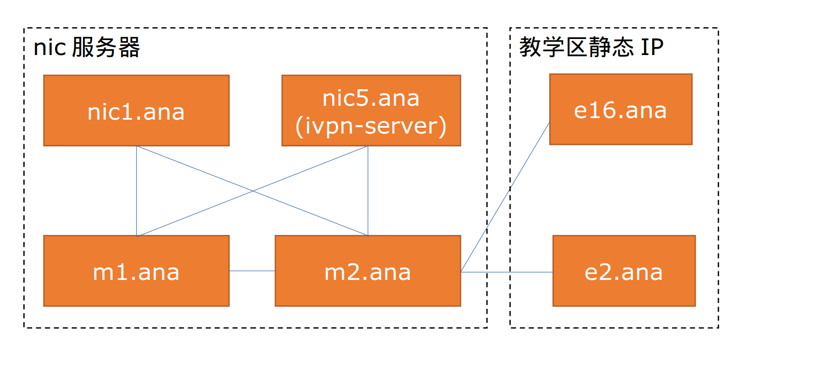

# ANA网络概况

## 西安交通大学校园网情况概况

### 网络接入情况

西安交通大学校园内的网络接入主要分为教育网（CERNET）接入和wenet运营商接入。所有ANA服务器都是接入的教育网，本节主要讨论教育网的相关情况。

对于网口来说，其接入的网络主要分为三个区域，分别为教学区，学生区和机房。教学区和学生区是两个不同的vlan，任意一个物理端口要么处于教学区，要么处于学生区。一般情况下学生宿舍的所有网口属于学生区（XJTUANA社办除外，所有XJTUANA社办网口属于教学区），其他网口属于教学区。机房区网口直接从nic2楼机房交换机引出，详情咨询nic。

西安交通大学的教育网接入方式主要有四种，分别为 学生区拨号接入，教学区拨号接入，教学区静态IP接入和机房静态IP接入。学生区拨号相关信息见XJTUANA公众号入网指南，教学区拨号帐号为 `netid@stu`，密码为上网密码，速度为50Mbps对等，有IPv6访问权限。静态IP接入需要向nic申请静态IP，并向nic申请绑定物理端口。端口绑定完成后即可按照nic给出的网络信息设置静态IP。目前ANA已经拥有的教学区静态IP信息如下：

| IP | 绑定的物理端口位置 | 网关 | 子网掩码 |
| ---- | ---- | ---- | ---- |
| 58.206.101.40 - 58.206.101.49 | E16社办 | 58.206.96.1 | 255.255.248.0 |
| 58.206.101.192 - 58.206.101.193 | E2社办 | 58.206.96.1 | 255.255.248.0 |
| 202.117.205.249 - 202.117.205.251 | 10号楼社办 | 202.117.205.129 | 255.255.255.128 |

### 网络相关限制
西安交通大学教育网监管较为严格，主要有如下限制：

+ 默认情况下校园网防火墙会阻断所有由校外发起的访问校内的TCP连接（理论上UDP连接也会被阻断，但是实测不会）。如果需要将某个服务暴露给校外访问，需要向nic报备服务信息并由nic进行安全测试。目前ANA唯一可以被校内访问的机器和端口为`m1.ana`的80和443端口。
+ 对于静态IP，包括教学区静态IP和机房静态IP，校园网防火墙会检查其发起的访问校外的流量是否具有风险，如果具有风险就会发布"恶意外联"通报并封禁该IP一段时间。解决"恶意外联"非常繁琐，并且会影响服务可用性，因此应当尽量避免出现"恶意外联"。常见的导致恶意外联的行为包括Wireguard流量（和其他特征明显的VPN流量），和校外黑名单IP建立连接，访问暗网，挖矿等等。

## XJTUANA内网概况

XJTUANA内网是仅限现役XJTUANA成员访问的安全虚拟网络，和公网完全隔离。现役XJTUANA成员需要使用shadowsocks协议访问内网。
当前阶段大多数研发部所使用的服务均需要使用XJTUANA内网。

## 使用XJTUANA内网的原因

很多内网服务的存在不方便给社团外暴露，同时暴露在公网上也无法给服务提供者和访问者提供足够安全保障。
因此需要使用XJTUANA内网将这些服务隐藏起来。

同时XJTUANA不具有足够的域名和公网IPv4地址，部分设备在堡垒机后无法直接访问，因此可以使用内网绕过这些措施，更加方便地访问各类服务。

## XJTUANA内网的结构

XJTUANA内网使用IPv4段为`10.58.0.0/16`，没有IPv6段。
XJTUANA内网使用私有域名`*.ana`。
必须使用内网内的私有DNS服务器或者预制的hosts（当前阶段）才能解析这些域名。

XJTUANA内网内有4台放置于机房区域的服务器，其分别为:

|  主机名   | IP  | 内网IP|
|  ----  | ----  | ---- |
| nic1.ana | 10.184.202.174 | 10.58.0.1|
| nic5.ana | 202.117.18.222 | 10.58.0.5|
| m1.ana | 202.117.13.130 | 10.58.0.6|
| m2.ana | 202.117.1.102 | 10.58.0.7|

（没有nic2, nic3, nic4是历史遗留问题）

此外还有3台以教学区静态IP的方式接入的服务器，其信息如下：

|  主机名   | IP  | 内网IP|
|  ----  | ----  | ---- |
| wms10.ana | 202.117.205.249 | 10.58.99.1|
| e16.ana | 58.206.101.49 | 10.58.100.1 |
| e2.ana | 58.206.101.193 | 10.58.101.1 |

每台服务器将根据他自身的内网IP获得如下规模的网段用于容器或者虚拟机：

设服务器A的IP为10.58.0.X，则他对应的网段为10.58.Y.0/24，其中Y=10+X(10进制)。
比如`nic1.ana`对应的网段为`10.58.11.0/24`。

内网内还有若干个特殊的网段，他们是：

| 网段 | 用途 |
| ---- | ---- |
| 10.58.20.0/24 | 生产环境微服务专用段 |
| 10.58.96.0/20 | 社办专用段（10号楼：10.58.99.0/24，E16：10.58.100.0/24，E2：10.58.101.0/24） |

实际使用中，我们可以认为服务器之间是全互联的，换言之，我们可以在一台服务器直接通过IP访问内网内的其他服务器。不过有些时候可能需要了解其实际链接的拓扑，其实际链接的拓扑如下图所示：

注意`nic1.ana`和`nic5.ana`之间受学校政策的影响无法进行互联，因此`nic1.ana`访问`nic5.ana`的流量需要经过`m1.ana`或者`m2.ana`转发。

因为校园网限制，特别是关于出校VPN的限制，有一部分ANA服务器没有接入内网，他们是：

| IP | 位置 | 提供商 | 主要服务 |
| ---- | ---- | ---- | ---- |
| 58.206.101.40-58.206.101.46 | 中国 | XJTUANA | 给社员提供福利性质的VPS(详情见此机文档) |
| 42.202.33.167, 42.203.52.55 | 中国 | 碳云 | 托管xjtuana.cn网站，将流量通过mirrors.xjtu.edu.cn (ipv4)传递至校内 |
| 18.166.240.234, 2406:da1e:22b:f500::4, 16.162.207.175, 2406:da1e:22b:f500::b076 | 香港 | AWS | 托管xjtuana.com网站，将流量通过mirrors.xjtu.edu.cn (ipv6)传递至校内，提供社团 frp 服务* |

* 此机器前两个地址只用于提供 xjtuana.com 网站相关服务。后两个地址用于提供 xjtuana.com 网站之外的服务。

除此之外，社团还拥有大量用于办公的台式电脑，他们不配置单独的IP，以DHCP的方式获取对应社办的内网IP进入内网。

## 如何访问XJTUANA内网？
当前阶段需要使用ivpn软件经过身份认证后才能访问研发部内网。参见[访问方法](http://git.ana/xjtuana/docs/src/branch/master/%E5%9F%BA%E6%9C%AC%E6%93%8D%E4%BD%9C%E6%96%87%E6%A1%A3/%E6%96%B0%E7%89%88%E5%86%85%E7%BD%91%E8%AE%BF%E9%97%AE%E6%96%87%E6%A1%A3.md)。

## XJTUANA内网的常用服务
|  地址   | 协议  | 服务描述| 所需身份 |
|  ----  | ----  | ---- | ---- |
| git.ana | HTTP | 社团git服务 | 社员 |
| drone.ana | http | drone CI | 研发部成员 |
| pma.ana | HTTP | 研发部phpmyadmin服务 | 研发部成员 |
| mariadb.nic1.ana | mariadb | 测试环境MariaDB数据库 | 研发部成员 |
| mariadb.nic5.ana | mariadb | 生产环境MariaDB数据库 | 研发部部长，研发副社长，社长 |
| mariadb.m1.ana | mariadb | 生产环境MariaDB数据库 | 研发部部长，研发副社长，社长 |
| mongodb.m2.ana | mongodb | 生产环境MongoDB数据库 | 研发部部长，研发副社长，社长 |
| swagger-ui.ana | http | Swagger文档查看器 | 社员 |
| pan.ana | http | 百度网盘离线下载服务 | 社员 |
| gpt.ana | http | ChatGPT服务 | 社员 |
| 10.58.17.201:1080 | socks5 | 出国代理服务，出口为HK | 社员 |
| *.dev.ana | 多种协议 | 项目的测试环境，其中*替换为对应项目的官方名称 | 研发部成员 |